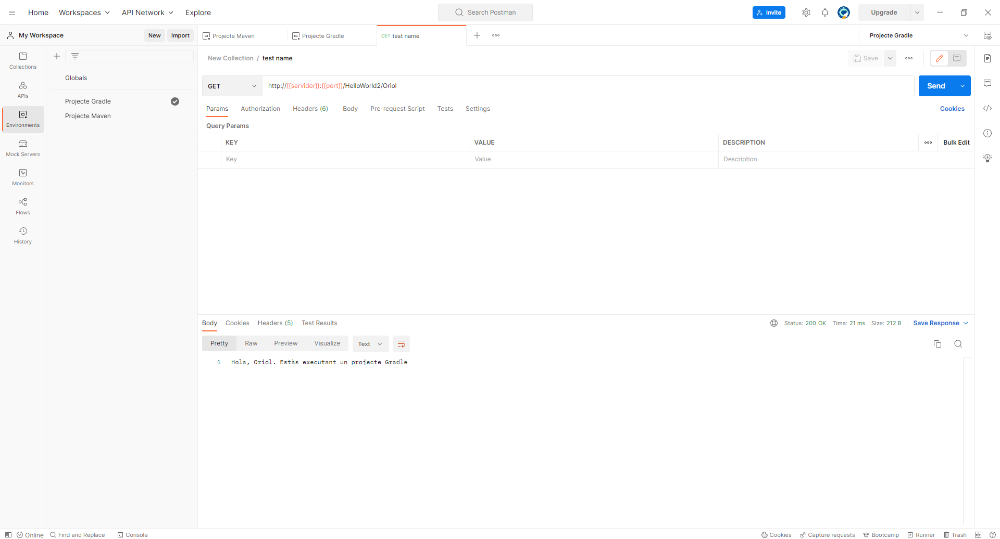
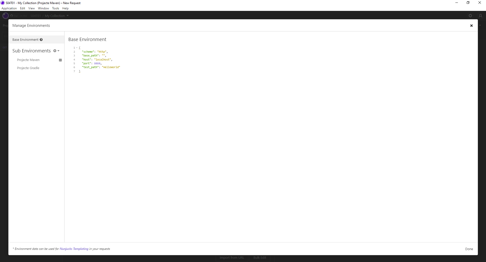
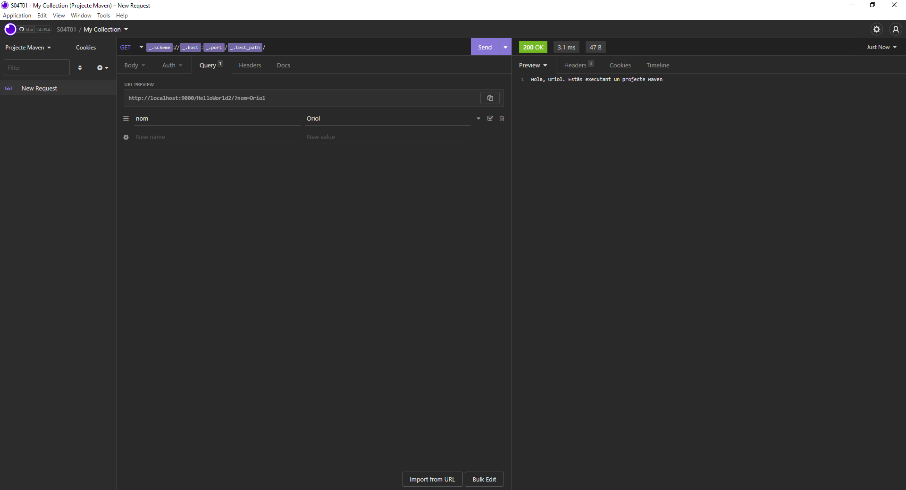
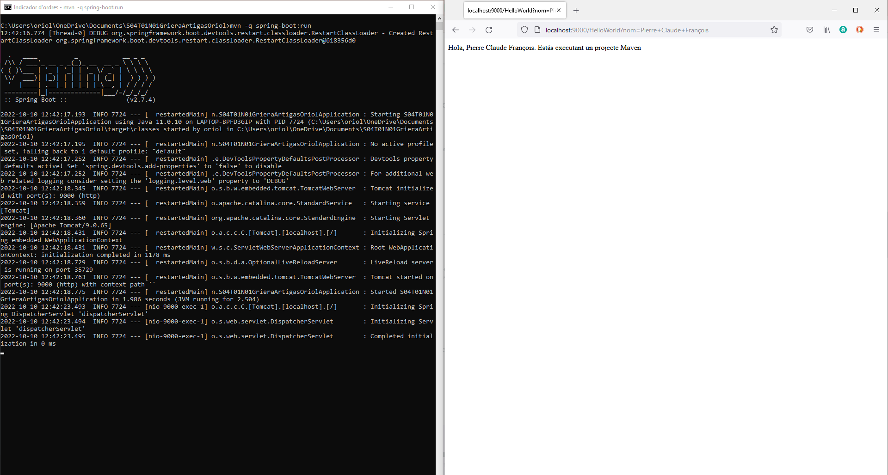

# Recursos

## Usual suspects
https://www.baeldung.com/spring-request-param
https://www.baeldung.com/spring-requestparam-vs-pathvariable
https://www.baeldung.com/spring-optional-path-variables
https://www.baeldung.com/spring-requestmapping

## Llibres ~~robats~~ que no són de compra
- Chris Richardson - Microservices Patterns_ With examples in Java-Manning Publications (2018)
- Ludovic Dewailly - Building a RESTful Web Service with Spring-Packt Publishing (2015)
- Magnus Larsson - Microservices with Spring Boot and Spring Cloud - Build resilient and scalable microservices using Spring Cloud, Istio, and Kubernetes-Packt (2021)
- Sam Newman - Monolith to Microservices_ Evolutionary Patterns to Transform Your Monolith-O’Reilly Media (2019)

# S4T01N3 Exercici Postman (+ insomnia)

# Compilació i execució des de terminal (Maven + Windows)
